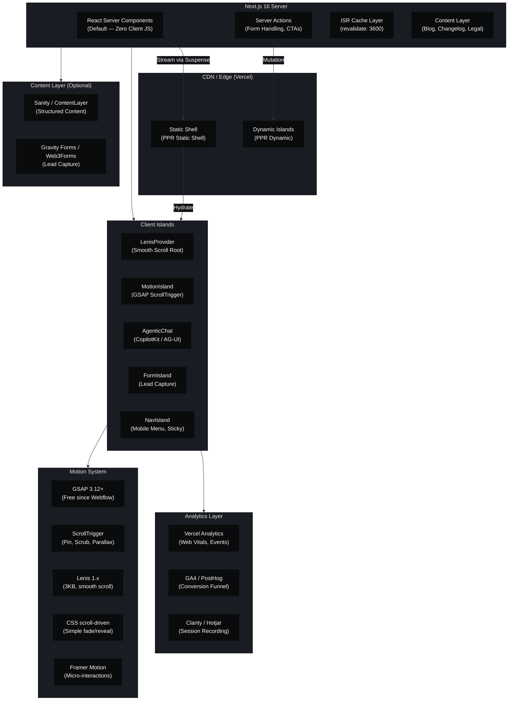

# Architecture — Premium SaaS Landing Page with Agentic UI

## 1. High-Level Architecture



## 2. Component Hierarchy & Design System Architecture

### Atomic Design Mapping

```
PRIMITIVES (Design Tokens)
├── Colors (OKLCH base, HSL semantic mapping)
├── Typography (Inter UI, JetBrains Mono display, PP Neue Montreal premium)
├── Spacing (4px grid, geometric sequence: 4, 8, 16, 24, 40, 64, 104)
├── Shadows (3-tier: --shadow-hue → primitives → public)
├── Motion (duration presets, easing curves, stagger delays)
└── Radius (none, sm, md, lg, xl, full)

ATOMS
├── Button (primary, secondary, ghost, outline, with-icon, loading)
├── Text (heading, subheading, body, caption, overline, code)
├── Badge (status, feature, pricing, notification)
├── Input (text, email, tel, textarea, select, checkbox, radio)
├── Icon (Lucide/Phosphor, inline SVG with size+color tokens)
├── Divider (horizontal, vertical, gradient)
├── Avatar (single, group, with-status)
├── Logo (dark, light, mono, animated)
└── Skeleton (text, card, avatar, hero)

MOLECULES
├── Card (feature, pricing, testimonial, team, blog, metric, bento)
├── Navigation (desktop, mobile, hamburger, breadcrumb, tabs)
├── FormGroup (label + input + error + helper)
├── Accordion (single, multiple, with-icon)
├── Tabs (underline, pill, icon)
├── Modal / Dialog (centered, slide-in, fullscreen)
├── Tooltip (top, bottom, left, right, rich)
├── Toast (success, error, info, warning, stackable)
├── Counter / CountUp (numbers, percentages, durations)
├── Marquee (logo cloud, testimonials, features)
└── CTA Group (single, double, with-meta-text)

ORGANISMS (Section Components)
├── Hero (default, split, video-background, live-demo, agentic)
├── Features (bento-grid, alternating-rows, tabs, carousel, comparison)
├── HowItWorks (numbered-steps, timeline, flowchart-animated)
├── Pricing (3-column, 4-column, toggle-annual, custom-enterprise)
├── Testimonials (carousel, grid, marquee, video, wall-of-love)
├── FAQ (accordion, categorized, searchable)
├── CTA (simple, split, with-demo-form, animated-graphic)
├── Stats / Metrics (counter-row, callout, comparison)
├── Integrations (logo-grid, category-tabs, searchable)
├── Blog (featured-card, grid, list, categories)
├── Contact (form, info-panel, map, live-chat)
├── Waitlist (email-capture, referral-counter, social-proof)
└── Footer (multi-column, simple, with-form)

TEMPLATES (Page Layouts)
├── HomePage (Hero + Features + HowItWorks + Testimonials + Pricing + FAQ + CTA)
├── PricingPage (Hero + Pricing + FAQ + Comparison + CTA)
├── BlogIndex (Hero + Featured + Grid + Categories + Subscribe)
├── BlogPost (Article + TOC + Related + Share + Subscribe)
├── Changelog (Timeline + Search + Subscribe + RSS)
├── About (Hero + Mission + Team + Metrics + CTA)
├── Contact (Form + Map + Info + Social + FAQ)
├── Legal (TOC, Privacy, Terms — static MDX)
├── Waitlist (Hero + Form + SocialProof + Referral + Preview)
├── 404 (Illustration + Search + CTAs)
└── _app (RootLayout, LenisProvider, AnalyticsProvider)
```

## 3. Design Token System

### 3.1 Color Architecture (OKLCH)

We use OKLCH for perceptual uniformity — a blue and yellow with the same lightness L value appear equally bright to the human eye. HSL is too irregular.

```
Primitives (raw palette)
───
--color-neutral-50:  oklch(98.5% 0.005 260)     /* off-white base     */
--color-neutral-100: oklch(95%   0.008 260)      /* card surface       */
--color-neutral-200: oklch(91%   0.01  260)      /* border subtle      */
--color-neutral-300: oklch(85%   0.015 260)      /* border             */
--color-neutral-400: oklch(70%   0.02  260)      /* placeholder        */
--color-neutral-500: oklch(55%   0.025 260)      /* muted text         */
--color-neutral-600: oklch(45%   0.03  260)      /* secondary text     */
--color-neutral-700: oklch(35%   0.03  260)      /* body text          */
--color-neutral-800: oklch(25%   0.025 260)      /* heading text       */
--color-neutral-900: oklch(15%   0.02  260)      /* near-black         */
--color-neutral-950: oklch(10%   0.015 260)      /* deepest dark       */

--color-accent-50:   oklch(95%  0.12  270)       /* accent tint        */
--color-accent-100:  oklch(90%  0.15  270)
--color-accent-300:  oklch(75%  0.20  270)
--color-accent-500:  oklch(55%  0.25  270)       /* primary accent      */
--color-accent-700:  oklch(40%  0.20  270)
--color-accent-900:  oklch(25%  0.15  270)

Semantic Tokens (purpose-mapped)
───
--color-bg:          var(--color-neutral-50)      /* page background    */
--color-bg-surface:  var(--color-neutral-100)     /* card surface       */
--color-bg-elevated: var(--color-neutral-0)       /* modal/dropdown     */
--color-bg-inverse:  var(--color-neutral-900)     /* dark sections      */

--color-text-primary:   var(--color-neutral-900)  /* headings           */
--color-text-secondary: var(--color-neutral-600)  /* body               */
--color-text-muted:     var(--color-neutral-400)  /* captions           */
--color-text-inverse:   var(--color-neutral-50)   /* on dark            */
--color-text-accent:    var(--color-accent-500)   /* links, highlights  */

--color-border:         var(--color-neutral-200)  /* default border     */
--color-border-strong:  var(--color-neutral-300)  /* hover/active       */
--color-border-accent:  var(--color-accent-300)   /* focus rings        */

--color-accent:      var(--color-accent-500)      /* single source      */
--color-accent-hover:var(--color-accent-700)
--color-success:     oklch(55% 0.18 145)
--color-warning:     oklch(65% 0.18 85)
--color-error:       oklch(55% 0.20 30)
--color-info:        oklch(60% 0.12 260)

Dark Mode (reverse on [data-theme="dark"])
───
--color-bg:          var(--color-neutral-950)
--color-bg-surface:  var(--color-neutral-900)
--color-text-primary:var(--color-neutral-50)
--color-text-secondary: var(--color-neutral-300)
--color-border:      var(--color-neutral-800)
```

### 3.2 Typography

```css
--font-sans:    'Inter', system-ui, -apple-system, sans-serif;
--font-display: 'JetBrains Mono', monospace;
--font-premium: 'PP Neue Montreal', 'Inter', sans-serif;

--text-xs:     0.75rem  (12px)  / 1.0;
--text-sm:     0.875rem (14px)  / 1.25;
--text-base:   1rem     (16px)  / 1.5;
--text-lg:     1.125rem (18px)  / 1.5;
--text-xl:     1.25rem  (20px)  / 1.4;
--text-2xl:    1.5rem   (24px)  / 1.3;
--text-3xl:    1.875rem (30px)  / 1.25;
--text-4xl:    2.25rem  (36px)  / 1.15;
--text-5xl:    3rem     (48px)  / 1.1;
--text-6xl:    3.75rem  (60px)  / 1.05;
--text-7xl:    4.5rem   (72px)  / 1.0;

--leading-tight:   1.05;
--leading-snug:    1.15;
--leading-normal:  1.5;
--leading-relaxed: 1.625;

--tracking-tight:  -0.025em;
--tracking-normal: 0;
--tracking-wide:   0.05em;

--font-weight-normal: 400;
--font-weight-medium: 500;
--font-weight-semibold: 600;
--font-weight-bold:    700;
```

### 3.3 Shadows (3-Tier System)

```css
/* Tier 1 — Hue primitive */
--shadow-hue: 260;

/* Tier 2 — Primitives */
--shadow-highlight:   0 0 0 1px hsl(var(--shadow-hue) 10% 90% / 0.5);
--shadow-shade:      0 2px 4px  hsl(var(--shadow-hue) 15% 5% / 0.06);
--shadow-contact:    0 4px 12px hsl(var(--shadow-hue) 15% 5% / 0.08);
--shadow-ambient:    0 12px 40px hsl(var(--shadow-hue) 15% 5% / 0.12);

/* Tier 3 — Public tokens */
--shadow-xs: var(--shadow-highlight);
--shadow-sm: var(--shadow-highlight), var(--shadow-shade);
--shadow-md: var(--shadow-highlight), var(--shadow-shade), var(--shadow-contact);
--shadow-lg: var(--shadow-highlight), var(--shadow-shade), var(--shadow-contact), var(--shadow-ambient);
--shadow-xl: var(--shadow-highlight), var(--shadow-shade), var(--shadow-contact), var(--shadow-ambient 2x);

/* Glow (for accent) */
--shadow-glow-sm: 0 0 8px  oklch(55% 0.25 270 / 0.3);
--shadow-glow-md: 0 0 20px oklch(55% 0.25 270 / 0.4);
--shadow-glow-lg: 0 0 40px oklch(55% 0.25 270 / 0.5);
```

### 3.4 Spacing & Layout

```css
--space-0:   0px;
--space-1:   0.25rem;   /*  4px */
--space-2:   0.5rem;    /*  8px */
--space-3:   0.75rem;   /* 12px */
--space-4:   1rem;      /* 16px */
--space-5:   1.25rem;   /* 20px */
--space-6:   1.5rem;    /* 24px */
--space-8:   2rem;      /* 32px */
--space-10:  2.5rem;    /* 40px */
--space-12:  3rem;      /* 48px */
--space-16:  4rem;      /* 64px */
--space-20:  5rem;      /* 80px */
--space-24:  6rem;      /* 96px */

--section-py: var(--space-24);  /* section vertical padding */
--section-px: var(--space-6);   /* section horizontal padding */
--container-max: 1280px;
--container-narrow: 768px;
--container-wide: 1440px;

/* Breakpoints */
--bp-sm: 640px;
--bp-md: 768px;
--bp-lg: 1024px;
--bp-xl: 1280px;
--bp-2xl: 1536px;
```

### 3.5 Motion Tokens

```css
/* Duration */
--duration-instant:  0ms;
--duration-fast:    150ms;
--duration-normal:  300ms;
--duration-slow:    500ms;
--duration-xslow:   800ms;
--duration-enter:   600ms;
--duration-exit:    300ms;

/* Easing */
--ease-out:     cubic-bezier(0.16, 1, 0.3, 1);
--ease-in:      cubic-bezier(0.4, 0, 1, 1);
--ease-in-out:  cubic-bezier(0.65, 0, 0.35, 1);
--ease-expo:    cubic-bezier(0.16, 1, 0.3, 1);
--ease-spring:  cubic-bezier(0.34, 1.56, 0.64, 1);
--ease-smooth:  cubic-bezier(0.22, 1, 0.36, 1);

/* Stagger */
--stagger-fast: 0.04s;
--stagger-normal: 0.08s;
--stagger-slow: 0.12s;

/* ScrollTrigger */
--trigger-start: "top 85%";
--trigger-end:   "top 35%";
```

## 4. Server-First Rendering Strategy

### 4.1 PPR (Partial Prerendering) — Default for Marketing Pages

Every page uses PPR to ship a static HTML shell immediately, then streams dynamic islands:

```tsx
// app/page.tsx — HomePage
export const experimental_ppr = true

export default function HomePage() {
  return (
    <>
      <HeroSection />                    {/* Static — rendered at build */}
      <Suspense fallback={<Skeleton />}>
        <LiveDemoSection />             {/* Dynamic — streamed */}
      </Suspense>
      <FeaturesSection />                {/* Static */}
      <Suspense fallback={<Skeleton />}>
        <AgenticChatPreview />          {/* Dynamic — client island */}
      </Suspense>
      <TestimonialsSection />            {/* Static */}
      <Suspense fallback={<Skeleton />}>
        <PricingSection />              {/* ISR — revalidates hourly */}
      </Suspense>
      <CTASection />                    {/* Static */}
    </>
  )
}
```

### 4.2 Component Split Strategy

```
RSC (Default — Zero Client JS)
├── Section wrappers (Section, Container, Grid, Flex)
├── Text components (Heading, Paragraph, Overline, Badge)
├── Static cards (FeatureCard, MetricCard, TestimonialCard)
├── Navigation (server-rendered links, desktop menu)
├── Footer (static content, links)
├── Blog layout (MDX content, TOC, share links)
└── SEO (generateMetadata, JSON-LD, OpenGraph)

Client Islands ("use client")
├── LenisProvider (smooth scroll root — mounted once)
├── MotionIsland (GSAP ScrollTrigger — per animated section)
├── InteractiveNav (mobile hamburger, sticky scroll effects)
├── PricingToggle (monthly/annual switch)
├── AccordionGroup (FAQ interative expand)
├── TabsGroup (feature tabs, integration tabs)
├── CounterAnimation (stat numbers, count-up)
├── FormIsland (waitlist, contact, demo forms)
├── AgenticChat (copilot-style assistant)
├── LiveDemo (interactive product demo)
├── Marquee (logo cloud, testimonial carousel)
├── Modal (video lightbox, login modal)
└── Toast (form submission feedback)
```

### 4.3 ISR Strategy

```
- Blog posts:       revalidate: 3600 (1 hour)
- Pricing:          revalidate: 3600
- Testimonials:     revalidate: 86400 (1 day)
- Changelog:        revalidate: 3600
- Legal pages:      revalidate: false (static, re-deploy on change)
- Home page:        revalidate: 3600
```

### 4.4 Caching with `use cache` (Next.js 16)

```tsx
// Server component with cache directive
export default async function PricingSection() {
  "use cache"
  cacheLife("hours") // or: cacheLife({ stale: 3600, revalidate: 3600 })

  const tiers = await getPricingTiers()
  return <PricingCards tiers={tiers} />
}
```

## 5. Motion System Architecture

### 5.1 Layer Separation

```
Motion needs by layer:
┌──────────────────────────────────────────────┐
│  Lenis (smooth scroll engine)                 │
│  → Normalizes wheel/trackpad/touch into       │
│    a single eased value. One instance.        │
├──────────────────────────────────────────────┤
│  GSAP + ScrollTrigger (scroll-linked anims)   │
│  → Pinned sections, scrubbed timelines,       │
│    parallax, clip-path reveals, split-text.  │
│  → Renders via useGSAP() in client islands.   │
├──────────────────────────────────────────────┤
│  Framer Motion (component enter/exit)         │
│  → Modal entrances, page transitions,         │
│    micro-interactions (button press, hover). │
│  → NOT used for scroll-driven animations.     │
├──────────────────────────────────────────────┤
│  CSS scroll-driven animations (simple case)   │
│  → Fade-in on enter, parallax backgrounds,    │
│    reading progress bar.                      │
│  → Zero JS, compositor thread, graceful       │
│    degradation via @supports.                 │
└──────────────────────────────────────────────┘
```

### 5.2 GSAP + Lenis Sync Pattern (The Canonical Solution)

```ts
// providers/lenis-provider.tsx
"use client"

import { ReactLenis, type LenisRef } from "lenis/react"
import { useEffect, useRef } from "react"
import { gsap } from "gsap"
import { ScrollTrigger } from "gsap/ScrollTrigger"

gsap.registerPlugin(ScrollTrigger)
ScrollTrigger.config({ ignoreMobileResize: true })

export function LenisProvider({ children }: { children: React.ReactNode }) {
  const lenisRef = useRef<LenisRef>(null)

  useEffect(() => {
    function raf(time: number) {
      lenisRef.current?.lenis?.raf(time)
      ScrollTrigger.update()
    }
    gsap.ticker.add(raf)
    gsap.ticker.lagSmoothing(0)
    return () => gsap.ticker.remove(raf)
  }, [])

  useEffect(() => {
    const lenis = lenisRef.current?.lenis
    if (!lenis) return
    const onScroll = ScrollTrigger.update
    lenis.on("scroll", onScroll)
    return () => lenis.off("scroll", onScroll)
  }, [])

  return (
    <ReactLenis
      root
      options={{
        autoRaf: false,
        syncTouch: true,
        lerp: 0.08,
        wheelMultiplier: 0.8,
        touchMultiplier: 1.2,
      }}
      ref={lenisRef}
    >
      {children}
    </ReactLenis>
  )
}
```

### 5.3 Motion Component Library Patterns

```tsx
// components/motion/reveal.tsx — Scroll Reveal
"use client"

import { useGSAP } from "@gsap/react"
import { useRef } from "react"

type Props = {
  children: React.ReactNode
  direction?: "up" | "down" | "left" | "right"
  delay?: number
  className?: string
}

export function Reveal({ children, direction = "up", delay = 0, className }: Props) {
  const ref = useRef<HTMLDivElement>(null)

  useGSAP(() => {
    // ...
  }, { scope: ref })

  return <div ref={ref} className={className}>{children}</div>
}
```

### 5.4 Scroll-Triggered Pin Sections

- **Hero pin**: Hero section pinned for full viewport height, content animates through 3 stages (headline → visual → CTA).
- **Features pin**: Feature showcase pinned, background video/image scrubs as user scrolls through 4 benefit pillars.
- **HowItWorks pin**: 3-step process with progress bar pinned, each step triggers at scroll position, icons animate on entry.
- **Testimonial pin**: Quote rotates through 5 testimonials as user scrolls, author details fade-transition.
- **CTA pin (max 2000px)**: Final CTA pinned, background gradient shifts, headline and button animate on entrance.

### 5.5 Purposeful Motion (Never Decorative)

```
Animation Type          Purpose
──────────────────────────────────────────────────────
Fade-in + translateY    Element enters viewport — hierarchy reveal
Stagger children        List of features/cards — sequential attention
Counter animation       Stats/metrics — emphasize numerical proof
Parallax background     Depth layering — immerse without distraction
Clip-path reveal        Hero headline — theatrical entrance
Pinned scrub            Feature demonstration — user controls narrative
Split text              Hero heading — emphasis on key value prop
Marquee                 Logo cloud — trust building without interaction cost
Smooth scroll (Lenis)   Brand quality — tactile feel of premium
```

## 6. Multi-Page Routing Structure

```
/                    → Home (PPR + dynamic islands)
/pricing             → Pricing (ISR, Server Actions for billing toggle)
/blog                → Blog index (ISR, paginated, searchable)
/blog/[slug]         → Blog post (ISR, MDX, related posts)
/changelog           → Changelog (ISR, RSS feed)
/about               → About (static, team bios)
/contact             → Contact (dynamic form, Server Action)
/waitlist            → Waitlist (dynamic form, Server Action)
/legal/privacy       → Privacy policy (static MDX)
/legal/terms         → Terms of service (static MDX)
/404                 → Custom 404 (static)
/robots.txt          → Dynamic (environment-aware)
/sitemap.xml         → Dynamic (all routes + blog posts)
```

## 7. Performance Budget

```
Metric              Target          Measurement
─────────────────────────────────────────────────────
LCP                 < 1.5s          Largest Contentful Paint
INP                 < 100ms         Interaction to Next Paint
CLS                 < 0.05          Cumulative Layout Shift
TBT                 < 100ms         Total Blocking Time
FCP                 < 0.8s          First Contentful Paint
TTFB                < 300ms         Time to First Byte
SI                  < 1.5s          Speed Index

Bundle Budget
├── /_next/static JS    < 150 KB (gzip)
├── Fonts (Inter)       < 30 KB  (self-hosted, subset)
├── Lenis               < 3 KB   (gzip)
├── GSAP core           < 15 KB  (gzip, tree-shaken)
├── Framer Motion       < 25 KB  (gzip, dynamic import)
└── Total per page      < 250 KB (gzip)

Image Budget
├── Hero image          < 100 KB (WebP/AVIF, 1920×1080)
├── Feature icons       < 10 KB  (SVG, optimized)
├── Testimonial avatars < 5 KB   (WebP, 80×80)
└── Blog thumbnails     < 50 KB  (WebP, 1200×630)
```

## 8. SEO & Metadata Architecture

### 8.1 generateMetadata Pattern (RSC)

```tsx
// app/layout.tsx — Root metadata
export async function generateMetadata(): Promise<Metadata> {
  return {
    metadataBase: new URL("https://saas.example.com"),
    title: {
      template: "%s | ProductName",
      default: "ProductName — AI-Powered [Outcome] for [Audience]",
    },
    description: "Value proposition in 150 chars. Outcome-driven, benefit-first.",
    openGraph: {
      type: "website",
      locale: "en_US",
      siteName: "ProductName",
      images: [{ url: "/og/default.png", width: 1200, height: 630 }],
    },
    twitter: { card: "summary_large_image", creator: "@handle" },
    robots: { index: true, follow: true },
    alternates: { canonical: "https://saas.example.com" },
  }
}
```

### 8.2 JSON-LD Structured Data

```tsx
// components/json-ld.tsx — RSC component
export function OrganizationLD() {
  const ld = {
    "@context": "https://schema.org",
    "@type": "SoftwareApplication",
    name: "ProductName",
    applicationCategory: "BusinessApplication",
    operatingSystem: "Web",
    offers: {
      "@type": "Offer",
      price: "19",
      priceCurrency: "USD",
    },
    aggregateRating: {
      "@type": "AggregateRating",
      ratingValue: "4.8",
      ratingCount: "1247",
    },
  }
  return <script type="application/ld+json" dangerouslySetInnerHTML={{ __html: JSON.stringify(ld) }} />
}
```

### 8.3 Automatic Sitemap

```tsx
// app/sitemap.ts
export default async function sitemap(): Promise<MetadataRoute.Sitemap> {
  const posts = await getBlogPosts()
  const blogEntries = posts.map((p) => ({
    url: `https://saas.example.com/blog/${p.slug}`,
    lastModified: p.updatedAt,
    changeFrequency: "weekly" as const,
    priority: 0.7,
  }))

  return [
    { url: "https://saas.example.com", lastModified: new Date(), changeFrequency: "weekly", priority: 1.0 },
    { url: "https://saas.example.com/pricing", lastModified: new Date(), changeFrequency: "weekly", priority: 0.9 },
    // ...static pages, changelog, blog entries
    ...blogEntries,
  ]
}
```

## 9. Analytics & Conversion Tracking Design

### 9.1 Event Taxonomy

```
Category        Event                   Trigger
─────────────────────────────────────────────────────────
Navigation      page_view               Every route change
                link_click              Internal/external link
                cta_click               Any CTA button
                anchor_nav              Same-page scroll to section

Engagement      scroll_depth           25%, 50%, 75%, 100%
                section_visible         Each section enters viewport
                time_on_page            15s, 30s, 60s, 120s
                video_start             Video play
                video_complete          Video ends

Conversion      pricing_view            Pricing section visible
                toggle_annual           Annual/monthly toggle
                plan_select             "Get Started" clicked
                form_start              Form field focused
                form_submit             Form successfully submitted
                form_error              Form validation failed

Agentic         chat_open               Agentic UI widget opened
                chat_message            Message sent
                chat_suggested_plan     Agent recommended a plan
                chat_booked_demo        Agent booked demo
                chat_escalated          Agent transferred to human
```

### 9.2 Custom Hook

```tsx
// lib/analytics.ts
export function useAnalytics() {
  const track = (event: string, properties?: Record<string, unknown>) => {
    if (typeof window === "undefined") return
    window.va?.("event", { name: event, data: properties })
    window.gtag?.("event", event, properties)
  }

  return { track }
}
```

### 9.3 Scroll Depth Tracking (Client Island, no extra lib)

```tsx
// components/analytics/scroll-depth.tsx
"use client"

import { useEffect, useRef } from "react"

export function ScrollDepthTracker() {
  const tracked = useRef(new Set<number>())

  useEffect(() => {
    const handleScroll = () => {
      const depth = Math.floor((window.scrollY + window.innerHeight) / document.body.scrollHeight * 100)
      ;[25, 50, 75, 100].forEach((threshold) => {
        if (depth >= threshold && !tracked.current.has(threshold)) {
          tracked.current.add(threshold)
          window.va?.("event", { name: `scroll_${threshold}`, data: { path: window.location.pathname } })
        }
      })
    }
    window.addEventListener("scroll", handleScroll, { passive: true })
    return () => window.removeEventListener("scroll", handleScroll)
  }, [])

  return null
}
```

### 9.4 Conversion Funnel Tracking

The funnel is instrumented via URL-based stages in GA4, combined with custom events:

```
Stage 1: Visit        → page_view (any page)
Stage 2: Engage       → section_visible (Features or Testimonials)
Stage 3: Pricing      → pricing_view
Stage 4: Select       → plan_select (specific plan ID)
Stage 5: StartSignup  → form_start
Stage 6: Signup       → form_submit (with plan_tier property)
Stage 7: Activate     → Server Action redirect to /dashboard (post-signup)
```

Each stage tracks drop-off % with segment breakdowns (traffic source, device, browser, referrer).
