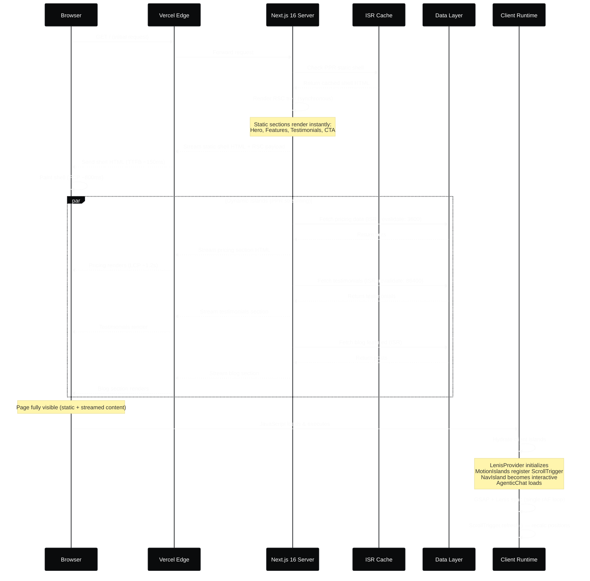
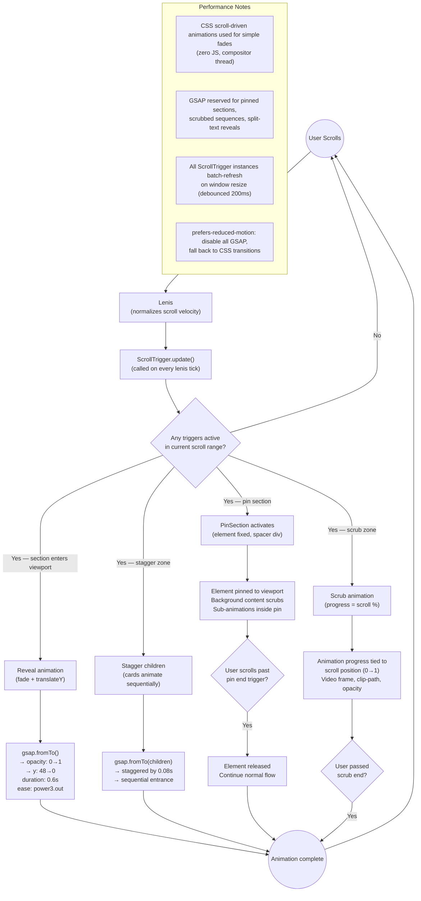
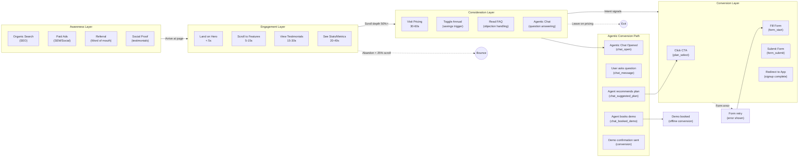
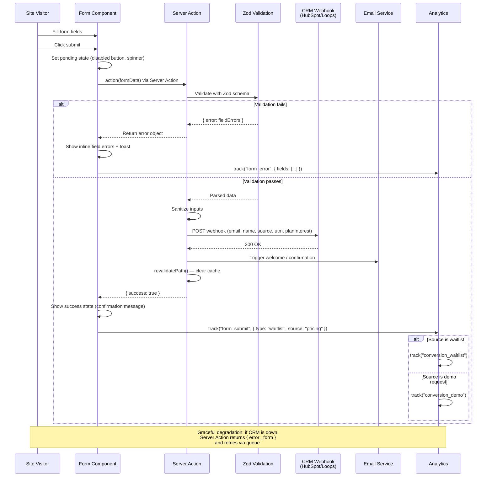
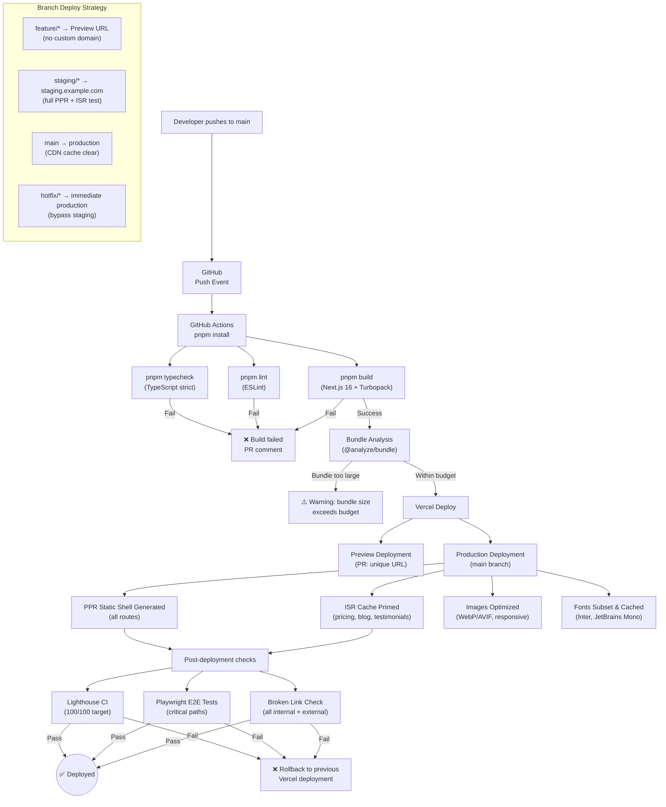
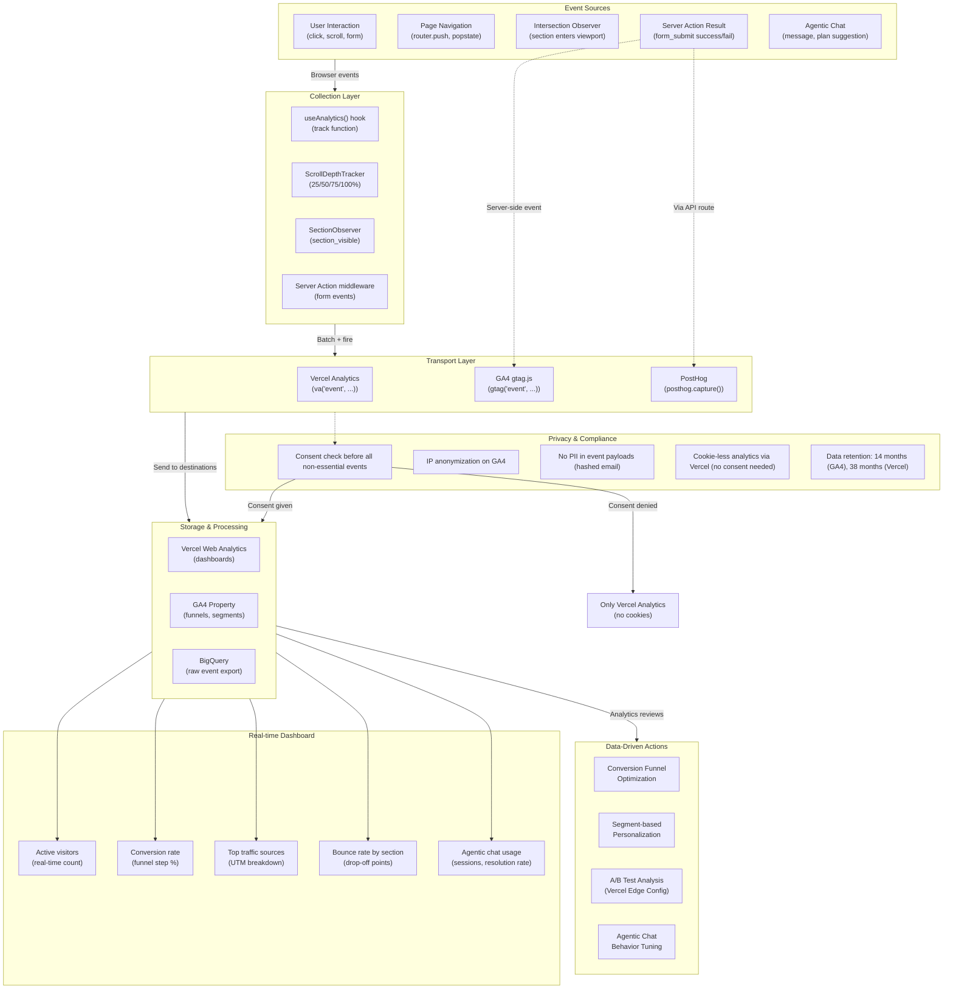
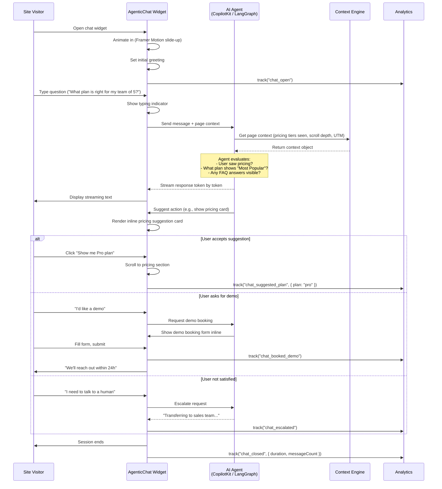

# Flow Diagrams — Premium SaaS Landing Page with Agentic UI

## 1. Page Rendering Lifecycle (PPR + RSC + Client Hydration)

## 2. Scroll-Driven Animation Trigger Flow

## 3. User Interaction → CTA Conversion Funnel

## 4. Form Submission & Lead Capture Pipeline

## 5. Build & Deployment Pipeline

## 6. Analytics Event Tracking Flow

## 7. Agentic UI — Chat Interaction Flow

